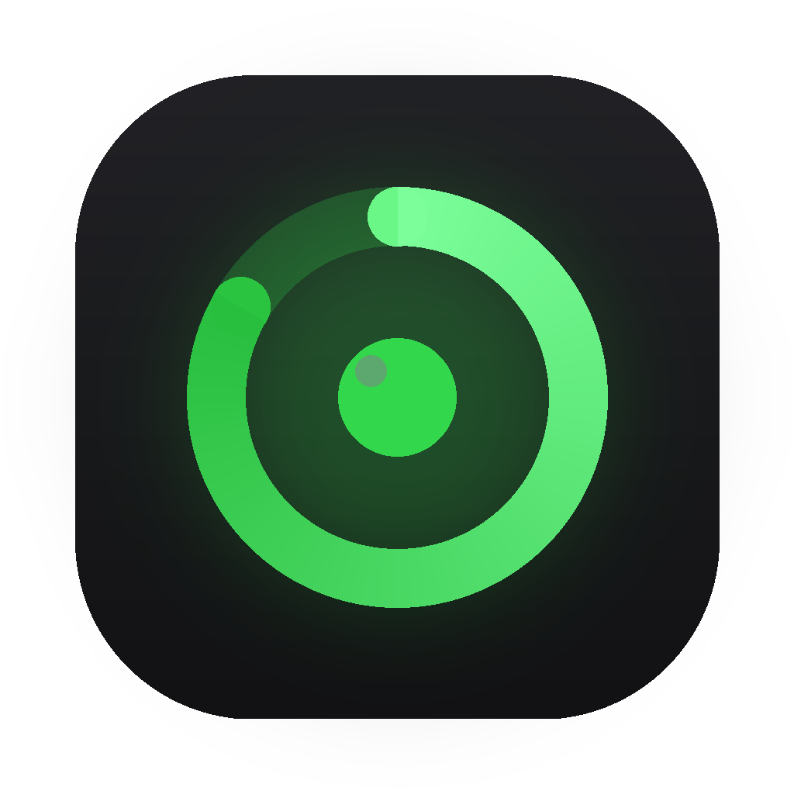

<div align="center">
  
  <h1>Focus ⏳</h1>
  <p><strong>A beautiful, zero-dependency Pomodoro timer</strong> — tasks, streaks, a GitHub-style focus heatmap, and deep session analytics. Runs in your browser <em>and</em> as a native macOS app. Your data never leaves your machine.</p>
  <p>
    <a href="https://github.com/aowshad/Focus/releases/latest"></a>
    
    
    <a href="LICENSE"></a>
  </p>
</div>

> 🔗 **Live demo:** https://aowshad.github.io/Focus/

<!-- Add a screenshot for maximum impact: docs/screenshot.png -->
<!--  -->

---

## Install (macOS)

### Homebrew (recommended)
```sh
brew install --cask aowshad/tap/focus
```
Homebrew handles the download and removes the quarantine flag automatically — the app just opens.

### Direct download
1. Download **`Focus-1.1.0-mac.zip`** from the [latest release](https://github.com/aowshad/Focus/releases/latest).
2. Unzip it and drag **Focus.app** into your **Applications** folder.
3. **First launch:** because the app isn't notarized by Apple (this is a free, open-source project), macOS shows an "unidentified developer" warning. To open it:
   - **Right-click** (or Control-click) **Focus.app → Open → Open**, or
   - if macOS still refuses, run once in Terminal:
     ```sh
     xattr -dr com.apple.quarantine /Applications/Focus.app
     ```
   You only need to do this once.

Requirements: **macOS 12 or later** · Apple silicon.

### Use it in the browser
No install needed — just open the [live demo](https://aowshad.github.io/Focus/), or clone and open `index.html`.

---

## Features

- **Pomodoro timer** — focus → short break → long break, fully configurable, with a live-pulsing cycle indicator and countdown in the title bar.
- **Tasks** — Today / Upcoming / All / Completed / Deleted views; attach a task to your sessions and its time flows into the analytics.
- 🔥 **Focus heatmap** — a GitHub-style contribution graph of your last six months, scaled to your daily goal. Click any day to inspect it.
- **Streaks** — current streak, best streak, total active days.
- **Analytics** — daily goal ring, streak-aware insights, weekly/10-day/monthly bar charts, per-task pie breakdown, day timeline, and monthly history with trends.
- **Native notifications** on macOS; **100% local** — no account, no tracking, no network.

---

## Build it yourself

The web app and the macOS app share one codebase (wrapped with [Tauri v2](https://tauri.app)). See **[BUILD.md](BUILD.md)** for the full setup, or with the toolchain installed:

```sh
./release.sh 1.1.0
```

This cleans, builds, signs, verifies, zips, and prints the SHA256 for the Homebrew cask.

---

## Project structure

```
Focus/
├── index.html        # web app markup + inline SVG icons
├── css/styles.css    # design tokens → components
├── js/app.js         # engine → analytics → ui (pure, layered)
├── src-tauri/        # native macOS shell (Tauri v2)
├── release.sh        # one-shot build + sign + package
└── BUILD.md          # macOS build & release guide
```

## License

[MIT](LICENSE) © Aowshad Himel
